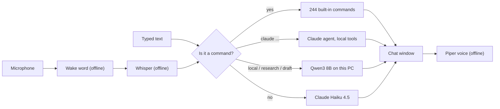

# Jarvis-AI project plan

Last updated: 5 October 2026.

## Goal

A personal assistant that lives on a Zorin OS desktop, opens at login, and
that you can talk to. Ask it anything: it runs a built-in command when one
fits and answers with AI when none does. It should be cheap to run, private
by default, and keep working when parts of the internet don't.

## Where it stands

| | |
|---|---|
| Code | on `master`; plan steps 1 and 3-6 done |
| CI | 6 of 6 checks pass on `master` |
| Commands | 243 load, from any folder and without a desktop session |
| Terminal | `Jarvis-AI` |
| Desktop window | **Jarvis** in the app menu, or `./jarvis-gui`; opens at login |
| Typical AI answer | about $0.003 and 2-3 s on Claude Haiku 4.5; command check about $0.004 |

### What Jarvis does

| Capability | How | Checked |
|---|---|---|
| Desktop window | Native GTK 4 app; opens at login; keeps listening when closed | tested |
| "Hey Jarvis" | Offline wake word, then Whisper speech-to-text on this machine | generated speech only |
| Spoken replies | Offline British voice (Piper); long lists summarised aloud | tested |
| Everyday questions | Anything that isn't a command goes to Claude Haiku 4.5, the cheapest model; follow-ups keep context | tested live |
| Picking the right command | When a command word appears mid-sentence, Haiku confirms it's really wanted ("I need to open up to my family" no longer runs `open`) | tested live |
| Offline backup | If Claude can't answer, the local model does (about 30 s) | tested live |
| `claude ...` | Full Claude agent with local tools; asks before it changes anything | tested live |
| `local`, `research`, `draft` | Free Qwen3 8B via Ollama; private, no per-use cost, ~30 s per answer on CPU | tested live |
| Weather, time abroad | Keyless services: "what time is it in Tokyo", "do I need an umbrella" | tested live |

### How a request is handled

Every request takes the cheapest path that can answer it.

### Not yet tried on real hardware

- Your own voice and microphone: every voice test used generated speech.
- An actual logout and login with the autostart entry.
- How the window looks on the Wayland display (checked from off-screen renders).

### Test suite

All failures from dead services and stale tests are fixed (see step 4). The
only test that cannot run is music recognition: its sample song on Google
Drive is gone, so it is skipped.

## Plan

1. **Merge the pull requests.** Done 5 October 2026.
2. **Tune voice to the real microphone** *(next, needs you)*. Use the window
   for a day and note what it mishears, misses, or wakes up to by mistake.
   With those notes: adjust `wake_threshold`, the silence timing, and the
   Whisper model size (`~/.config/jarvis/gui.json`, see `doc/GUI.md`).
3. **Let Claude pick the right command.** Done. Mid-sentence keyword matches
   are confirmed by Haiku; commands typed directly are never checked. About
   $0.004 and 1-2.5 s per check; turn off with the window's menu or
   `JARVIS_AI_ROUTER=0`.
4. **Repair or retire commands that call dead services.** Done.
   Repaired: `wiki` (direct Wikipedia API), `name_day` (v2 API, no embedded
   key), `hackernews` (new page markup), `screencapture` (loads without a
   display). Removed: `twitter_trends` (service gone) and `wiki_summary`
   (duplicate of `wiki summary`). Fixed the "Jarvis, ..." routing bug and 13
   stale tests. `movie` still needs IMDb's datasets imported to work.
5. **Light packaging.** Done. `pyproject.toml`; `./env/bin/pip install -e .`
   adds `Jarvis-AI` and `jarvis-gui` to the virtualenv, with dependencies
   read from the same files the installers use. The 240 original commands
   stay where they are, so upstream fixes still merge cleanly.
6. **Role for the local model.** Done. Qwen3 8B handles `local`, `research`
   and `draft`, and answers everyday questions when Claude can't.

### After that

- Replace `movie`'s data source with a keyless one, or remove it.
- Decide the open questions below.

## Open decisions

| Decision | Now | Recommendation |
|---|---|---|
| Default model for `claude ...` | Opus 5.5 ($4 / $20 per million tokens) | Sonnet 5.5; keep `claude model opus` for hard jobs |
| Claude account connectors | Off for Jarvis (they made the first answer take over a minute) | Keep off; add back the few you want via `.mcp.json` |
| "Hey Jarvis" wake-word model | CC BY-NC-SA 4.0, non-commercial | Fine for personal use; replace before any commercial release |

## Where things live

| Path | What |
|---|---|
| `bootstrap.sh` | Installer for Debian / Ubuntu / Zorin; writes `./Jarvis-AI` |
| `installer/` | Cross-platform installer (`python3 installer`) and the requirement lists: `requirements-lean.txt` (runtime), `requirements-gui.txt` (window and voice), `requirements-dev.txt` (tests), `requirements.txt` (lean + dev) |
| `scripts/` | `install-gui.sh`, `install-local-llm.sh`, `install-autostart.sh`, `jarvis-terminal.sh` |
| `jarviscli/` | The assistant: `Jarvis.py` (routing), `plugins/` (commands), `packages/` (helpers, incl. `geo.py`, `ai_brain.py`, `local_llm.py`, `wiki_api.py`), `gui/` (window, voice, engine), `launcher.py` (pip entry points), `tests/` |
| `pyproject.toml` | Packaging for `pip install -e .` |
| `custom/` | Your own plugins; loaded at startup, ignored by git |
| `doc/` | `GUI.md`, `CLAUDE_AGENT.md`, `PLUGINS.md`, `API.md`, `TESTING.md`, this plan |
| `.github/workflows/ci.yml` | CI: dependency resolution on Python 3.10-3.13, lint, install, startup and window checks |

Generated on install and not in git: `Jarvis-AI`, `jarvis-gui`, `env/`.
User data lives outside the repo: `~/.config/jarvis/` (settings) and
`~/.local/share/jarvis/` (voice and speech models).
