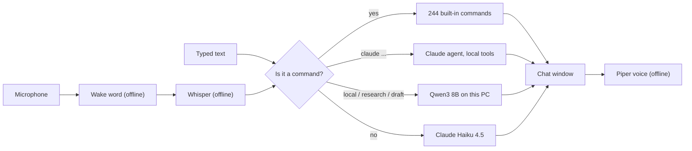

# Jarvis-AI project plan

Last updated: 5 October 2026.

## Goal

A personal assistant that lives on a Zorin OS desktop, opens at login, and
that you can talk to. Ask it anything: it runs a built-in command when one
fits and answers with AI when none does. It should be cheap to run, private
by default, and keep working when parts of the internet don't.

## Where it stands

| | |
|---|---|
| Code | merged on `master` ([#1](https://github.com/nbrookes80-spec/Jarvis/pull/1), [#2](https://github.com/nbrookes80-spec/Jarvis/pull/2)) |
| CI | 6 of 6 checks pass on `master` |
| Commands | 244 load, from any folder |
| Terminal | `Jarvis-AI` |
| Desktop window | **Jarvis** in the app menu, or `./jarvis-gui`; opens at login |
| Typical AI answer | about $0.003 and 2-3 s on Claude Haiku 4.5 |

### What Jarvis does

| Capability | How | Checked |
|---|---|---|
| Desktop window | Native GTK 4 app; opens at login; keeps listening when closed | tested |
| "Hey Jarvis" | Offline wake word, then Whisper speech-to-text on this machine | generated speech only |
| Spoken replies | Offline British voice (Piper); long lists summarised aloud | tested |
| Everyday questions | Anything that isn't a command goes to Claude Haiku 4.5, the cheapest model; follow-ups keep context | tested live |
| `claude ...` | Full Claude agent with local tools; asks before it changes anything | tested live |
| `local`, `research`, `draft` | Free Qwen3 8B via Ollama; private, no per-use cost, ~30 s per answer on CPU | tested live |
| Weather, time abroad | Keyless services: "what time is it in Tokyo", "do I need an umbrella" | tested live |

### How a request is handled

Every request takes the cheapest path that can answer it.

### Not yet tried on real hardware

- Your own voice and microphone: every voice test used generated speech.
- An actual logout and login with the autostart entry.
- How the window looks on the Wayland display (checked from off-screen renders).

## Plan

In order. Step 1 is done.

1. **Merge both pull requests.** Done 5 October 2026.
2. **Tune voice to the real microphone** *(recommended next)*. Use it for a day,
   note what it mishears or wakes up to, then adjust wake sensitivity, silence
   timing and Whisper model size. Effort: an hour once there are notes.
3. **Let Claude pick the right command** *(recommended)*. Jarvis matches single
   words, so "how far is the Moon?" can land on the moon-phase command. A small
   Haiku call would choose the command or answer directly. About $0.001 per
   request; half a day of work. The biggest remaining quality gain.
4. **Retire the commands that call dead services.** About 40 tests fail because
   the services those commands use no longer exist. Repair the useful ones with
   working sources and remove the rest. `movie` is one: its library now needs
   IMDb's datasets downloaded locally. One to two days.
5. **Light packaging.** Add `pyproject.toml` and an installable `Jarvis-AI`
   entry point. Leave the original 240 commands where they are, so fixes from
   the upstream project still merge cleanly. Half a day.
6. **Choose a role for the local model.** Keep Qwen3 8B for drafts, research
   and offline use, or switch to the faster `qwen3:4b`.

## Open decisions

| Decision | Now | Recommendation |
|---|---|---|
| Default model for `claude ...` | Opus 5.5 ($4 / $20 per million tokens) | Sonnet 5.5; keep `claude model opus` for hard jobs |
| Claude account connectors | Off for Jarvis (they made the first answer take over a minute) | Keep off; add back the few you want via `.mcp.json` |
| "Hey Jarvis" wake-word model | CC BY-NC-SA 4.0, non-commercial | Fine for personal use; replace before any commercial release |

## Where things live

| Path | What |
|---|---|
| `bootstrap.sh` | Installer for Debian / Ubuntu / Zorin; writes `./Jarvis-AI` |
| `installer/` | Cross-platform installer (`python3 installer`) and the requirement lists: `requirements-lean.txt` (runtime), `requirements-gui.txt` (window and voice), `requirements-dev.txt` (tests), `requirements.txt` (lean + dev) |
| `scripts/` | `install-gui.sh`, `install-local-llm.sh`, `install-autostart.sh`, `jarvis-terminal.sh` |
| `jarviscli/` | The assistant: `Jarvis.py` (routing), `plugins/` (commands), `packages/` (helpers, incl. `geo.py`, `ai_brain.py`, `local_llm.py`), `gui/` (window, voice, engine), `tests/` |
| `custom/` | Your own plugins; loaded at startup, ignored by git |
| `doc/` | `GUI.md`, `CLAUDE_AGENT.md`, `PLUGINS.md`, `API.md`, `TESTING.md`, this plan |
| `.github/workflows/ci.yml` | CI: dependency resolution on Python 3.10-3.13, lint, install, startup and window checks |

Generated on install and not in git: `Jarvis-AI`, `jarvis-gui`, `env/`.
User data lives outside the repo: `~/.config/jarvis/` (settings) and
`~/.local/share/jarvis/` (voice and speech models).
